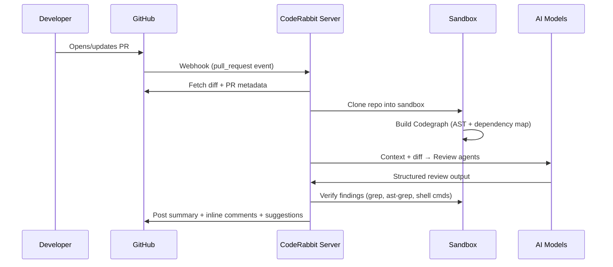
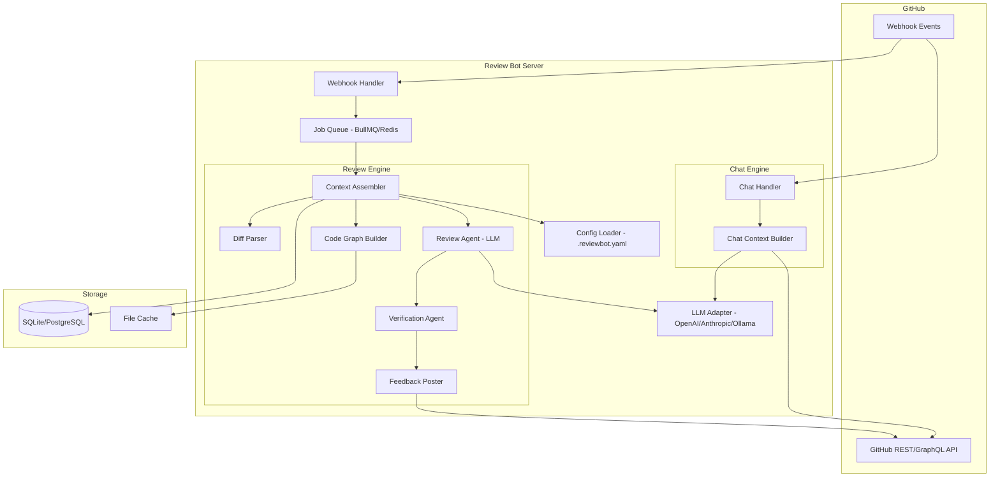

# Free CodeRabbit Alternative — Research & Planning Document

> **Goal:** Build an open-source, self-hosted AI code review bot that covers 80%+ of CodeRabbit's value at zero cost to the user.

---

## 1. How CodeRabbit Actually Works

### 1.1 The Review Pipeline

CodeRabbit isn't a single LLM call — it's a **multi-agent pipeline** that triggers on PR events:



### 1.2 Core Components

| Component | What It Does | How |
|:---|:---|:---|
| **Webhook Receiver** | Catches PR open/sync/comment events | GitHub App webhooks |
| **Codegraph** | Maps repo structure — functions, imports, dependencies, call chains | AST parsing via tree-sitter, file indexing |
| **Context Assembler** | Builds the "case file" — diff + affected files + codegraph + config + prior reviews | Combines multiple data sources |
| **Review Agents** | Specialized AI passes — security, logic, style, summary, verification | Parallel LLM calls with structured prompts |
| **Verification Sandbox** | Runs `grep`, `ast-grep`, `cat` to confirm AI findings before posting | Isolated container/process |
| **Feedback Poster** | Posts walkthrough, inline comments, suggestions to PR | GitHub API (reviews + comments) |
| **Chat Handler** | Responds to `@mention` commands in PR comments | Webhook → LLM → reply |
| **Memory/Learning** | Adapts to team patterns over time | Past reviews, resolved/dismissed feedback |

### 1.3 What CodeRabbit's Output Looks Like

A typical CodeRabbit review posts:

1. **PR Summary** — High-level overview appended to PR description
2. **Walkthrough** — File-by-file change description with logical grouping
3. **Sequence Diagrams** — Auto-generated Mermaid diagrams for complex interactions
4. **Inline Review Comments** — Specific issues on exact lines with:
   - Problem description
   - Why it matters (context)
   - Suggested fix (as GitHub suggestion block — one-click apply)
5. **Actionable Labels** — Bug, security, performance, style categories

### 1.4 Key Differentiators vs Naive "LLM + diff" Approach

| Naive Approach | CodeRabbit's Approach |
|:---|:---|
| Send raw diff to LLM | Build codegraph → understand blast radius |
| Single LLM pass | Multi-agent pipeline (review, verify, chat) |
| LLM may hallucinate | Verification sandbox — grep/ast-grep confirms before posting |
| No memory | Learns from dismissed comments, team patterns |
| Reviews entire PR every push | Incremental review — only new changes since last review |
| Text-based pattern matching | AST-aware analysis via tree-sitter/ast-grep |

---

## 2. The Market Gap (Why Build This)

### 2.1 CodeRabbit Pricing

| Tier | Price | Key Limits |
|:---|:---|:---|
| Free | $0 | 200 files/hr, 3 back-to-back then 4/hr, community support only |
| Essentials | $24/dev/mo | Linters, analytics, autofix |
| Team | $48/dev/mo | Planning, unit test gen, triage |
| Advanced | $72/dev/mo | Architectural analysis, security monitoring |

**Pain points we exploit:**
- Free tier is rate-limited aggressively
- Paid plans are per-seat — expensive for teams
- Code leaves your infra (privacy concern for enterprises)
- No model choice — locked to their LLM selection

### 2.2 Existing Open-Source Alternatives

| Tool | Approach | Gaps |
|:---|:---|:---|
| **PR-Agent** (CodiumAI) | GitHub Action, BYOK | No codegraph, no verification sandbox, single-pass |
| **Kodus** | Self-hosted Docker, BYOK | Complex setup, less mature |
| **Pullfrog** | GitHub Action, BYOK | Lightweight, no cross-file analysis |
| **Robin** | GitHub Action, BYOK | Basic, no advanced features |

**None of them have:**
- Code graph / cross-file dependency analysis
- Verification sandbox (proof before posting)
- Incremental review tracking
- Sequence diagram generation
- Rich conversational chat

---

## 3. What We're Building

### 3.1 Product Definition

**Name:** TBD (working name needed)

**Type:** A **GitHub App** (primary) + **GitHub Action** (secondary) that provides AI-powered code review on pull requests.

**Core principles:**
- **BYOK** — Bring your own API key (OpenAI, Anthropic, Ollama, any OpenAI-compatible endpoint)
- **Self-hosted first** — Run on your own infra with Docker
- **No rate limits** — Only limited by your LLM provider's rate limits
- **Privacy** — Code never leaves your infrastructure
- **Open source** — MIT or Apache-2.0 license

### 3.2 Program Type Decision

This needs to be a **server application**, not a CLI tool or browser extension:

```
┌─────────────────────────────────────────────────────┐
│                 DEPLOYMENT OPTIONS                    │
├─────────────────────────────────────────────────────┤
│                                                       │
│  Option A: GitHub App (Recommended Primary)           │
│  ├── Standalone Node.js/TypeScript server             │
│  ├── Receives webhooks from GitHub                    │
│  ├── Runs on your server / VPS / Docker               │
│  ├── Can serve multiple repos/orgs                    │
│  └── Best UX — auto-triggers, no CI config needed     │
│                                                       │
│  Option B: GitHub Action (Secondary)                  │
│  ├── Runs inside GitHub Actions CI                    │
│  ├── Zero server needed                               │
│  ├── Consumes Actions minutes                         │
│  ├── Per-repo setup (add YAML workflow)               │
│  └── Good for users who don't want to host            │
│                                                       │
│  Option C: CLI (Complementary)                        │
│  ├── Run locally before pushing                       │
│  ├── Review any diff/branch                           │
│  └── Good for pre-PR validation                       │
│                                                       │
└─────────────────────────────────────────────────────┘
```

> [!IMPORTANT]
> **Build the GitHub App first.** It's the core product. The GitHub Action and CLI are thin wrappers around the same review engine.

### 3.3 Feature Set — MVP vs Full

#### MVP (Phase 1)

| Feature | Description |
|:---|:---|
| **PR Summary** | Auto-generated summary posted to PR description |
| **Walkthrough** | File-by-file change description |
| **Inline Comments** | Line-specific review comments with severity |
| **Suggested Fixes** | GitHub suggestion blocks (one-click apply) |
| **Incremental Review** | Only review new changes on subsequent pushes |
| **@mention Chat** | Reply to `@bot review`, `@bot explain`, etc. |
| **YAML Config** | `.reviewbot.yaml` for path filters, instructions, behavior |
| **BYOK** | Support OpenAI, Anthropic, and any OpenAI-compatible API |

#### Phase 2

| Feature | Description |
|:---|:---|
| **Code Graph** | Cross-file dependency analysis via tree-sitter |
| **Verification** | Run ast-grep/grep to confirm findings before posting |
| **Sequence Diagrams** | Auto-generate Mermaid diagrams for complex flows |
| **Static Analysis** | Integrate ESLint, Ruff, Clippy, etc. alongside AI |
| **Review Memory** | Remember dismissed comments, adapt over time |

#### Phase 3

| Feature | Description |
|:---|:---|
| **GitHub Action mode** | Zero-server deployment option |
| **CLI mode** | Local pre-PR review |
| **GitLab/Bitbucket** | Multi-platform support |
| **Web Dashboard** | Review history, analytics, configuration UI |
| **Auto-fix Agent** | Apply fixes to a new commit automatically |

---

## 4. Architecture

### 4.1 System Architecture



### 4.2 Tech Stack

| Layer | Technology | Rationale |
|:---|:---|:---|
| **Language** | TypeScript (Node.js) | GitHub ecosystem is JS-native, Probot exists, Octokit is first-class |
| **Framework** | Probot or raw Express/Fastify | Probot handles auth/webhooks; raw server for more control |
| **LLM Client** | Vercel AI SDK or LiteLLM | Model-agnostic — single interface for OpenAI, Anthropic, Ollama, etc. |
| **Job Queue** | BullMQ + Redis | Async processing — don't block webhook responses |
| **AST Parsing** | tree-sitter (via node bindings) | Language-agnostic AST for code graph |
| **Pattern Matching** | ast-grep (CLI) | Structural code search for verification |
| **Diff Parsing** | `parse-diff` npm package | Parse unified diffs into structured data |
| **Database** | SQLite (dev) / PostgreSQL (prod) | Review history, memory, config cache |
| **Deployment** | Docker + docker-compose | Self-hosted, single command setup |
| **CI/CD** | GitHub Actions | Dogfooding — review our own PRs |

### 4.3 Key Data Flows

#### A. PR Opened/Updated → Review

```
1. GitHub sends `pull_request.opened` or `pull_request.synchronize` webhook
2. Webhook handler validates signature, extracts PR metadata
3. Job queued: { repo, pr_number, action, installation_id }
4. Worker picks up job:
   a. Fetch diff via GitHub API (GET /repos/:owner/:repo/pulls/:pr/files)
   b. Load .reviewbot.yaml from repo (if exists)
   c. Apply path filters — skip excluded files
   d. For each file in diff:
      - Parse hunks into structured changes
      - (Phase 2) Build local code graph — imports, exports, callers
      - Load path-specific instructions
   e. Assemble LLM prompt:
      - System: "You are a code reviewer. Follow these rules: {config.instructions}"
      - Context: file contents, diff hunks, path instructions
      - Task: "Review these changes. Output structured JSON."
   f. Call LLM via adapter
   g. Parse structured response → review comments
   h. (Phase 2) Verification: run ast-grep checks on flagged patterns
   i. Post to GitHub:
      - Update PR description with summary
      - Create review with inline comments
      - Add suggestion blocks where applicable
5. Store review metadata in DB (for incremental review tracking)
```

#### B. Incremental Review (New Push to Reviewed PR)

```
1. `pull_request.synchronize` webhook received
2. Load previous review state from DB
3. Compute diff between last-reviewed commit and HEAD
4. Only process new/changed files
5. Run review pipeline on delta only
6. Post new comments (don't repeat previous feedback)
```

#### C. Chat (@mention in PR comment)

```
1. `issue_comment.created` webhook with @bot mention
2. Parse command: review | explain | fix | help | approve | pause | resume
3. Build context: PR diff + file contents + conversation thread
4. Call LLM with chat prompt
5. Reply as comment on the PR
```

### 4.4 Configuration Schema

```yaml
# .reviewbot.yaml — placed in repo root

# LLM settings (overridden by server env for self-hosted)
# model: gpt-4o  # Usually set server-side

# Review behavior
reviews:
  # auto-review on PR open/update
  auto_review: true
  
  # Review profile: "chill" | "assertive" | "strict"
  profile: "assertive"
  
  # Files to exclude from review
  path_filters:
    - "!dist/**"
    - "!**/*.lock"
    - "!**/*.min.js"
    - "!**/generated/**"
    - "!**/*.snap"
  
  # Path-specific review instructions
  path_instructions:
    - path: "src/api/**"
      instructions: |
        - Focus on input validation and auth checks
        - Flag any direct SQL queries (use ORM)
        - Ensure proper error handling
    - path: "tests/**"
      instructions: |
        - Check test coverage of edge cases
        - Ensure descriptive test names
    - path: "*.md"
      instructions: |
        - Check for broken links
        - Light review only

# Summary settings
summary:
  enabled: true
  position: "description"  # "description" | "comment"

# Walkthrough settings
walkthrough:
  enabled: true
  collapse_threshold: 10  # Collapse if > N files changed

# Sequence diagrams
sequence_diagrams:
  enabled: true
  auto_generate: true

# Chat settings
chat:
  enabled: true
  
# Global review instructions
instructions: |
  - Follow the project's existing code style
  - Flag potential security issues
  - Suggest performance improvements where obvious
  - Be concise — no fluff
```

---

## 5. GitHub App Integration — How It Works

### 5.1 What Is a GitHub App

A GitHub App is a first-class integration that:
- Gets installed on repos/orgs by owners
- Receives webhook events (PR opened, comment created, etc.)
- Authenticates as itself (not a user) via JWT + installation tokens
- Has granular permissions (read/write PR, read contents, etc.)

### 5.2 Required Permissions

| Permission | Access | Why |
|:---|:---|:---|
| Pull requests | Read & Write | Read PR data, post reviews/comments |
| Contents | Read only | Read repo files (diff, config, source code) |
| Metadata | Read only | Required baseline |
| Issues | Read & Write | Post/read comments (chat via `@mention`) |
| Commit statuses | Read & Write | Optional: post status checks |

### 5.3 Webhook Events to Subscribe

| Event | Trigger | Our Action |
|:---|:---|:---|
| `pull_request.opened` | PR created | Full review |
| `pull_request.synchronize` | New commits pushed | Incremental review |
| `pull_request.reopened` | PR reopened | Full review |
| `issue_comment.created` | Comment on PR with @mention | Chat handler |
| `pull_request_review_comment.created` | Reply to inline comment | Chat handler |

### 5.4 Authentication Flow

```
1. Register GitHub App on GitHub (get APP_ID, generate PRIVATE_KEY)
2. User installs app on their repo/org
3. GitHub assigns an installation_id
4. On webhook:
   a. Verify webhook signature (WEBHOOK_SECRET)
   b. Use APP_ID + PRIVATE_KEY to generate JWT
   c. Exchange JWT for installation access token (scoped to that install)
   d. Use token for all GitHub API calls for that repo
```

---

## 6. LLM Integration Strategy

### 6.1 Model-Agnostic Adapter

```typescript
// Simplified adapter interface
interface LLMAdapter {
  chat(messages: Message[], options?: LLMOptions): Promise<LLMResponse>;
  stream(messages: Message[], options?: LLMOptions): AsyncIterable<string>;
}

// Supports: OpenAI, Anthropic, Ollama, any OpenAI-compatible API
// Use Vercel AI SDK or LiteLLM as the unified layer
```

### 6.2 Prompt Architecture

```
┌──────────────────────────────────────────────┐
│              SYSTEM PROMPT                    │
│  Role: Senior code reviewer                  │
│  Output format: Structured JSON              │
│  Rules: from .reviewbot.yaml instructions    │
│  Path rules: from path_instructions config   │
├──────────────────────────────────────────────┤
│              CONTEXT                          │
│  File: src/auth/login.ts                     │
│  Language: TypeScript                        │
│  Related files: (imports, callers)            │
│  Previous review: (if incremental)            │
├──────────────────────────────────────────────┤
│              DIFF / CHANGES                   │
│  @@ -15,7 +15,10 @@                          │
│  - old code                                   │
│  + new code                                   │
├──────────────────────────────────────────────┤
│              TASK                             │
│  Review. Output JSON array of findings.       │
│  Each: { line, severity, message, suggestion }│
└──────────────────────────────────────────────┘
```

### 6.3 Structured Output Schema

```typescript
interface ReviewOutput {
  summary: string;
  walkthrough: FileWalkthrough[];
  comments: ReviewComment[];
}

interface ReviewComment {
  file: string;
  line: number;         // line in the diff
  side: "LEFT" | "RIGHT";
  severity: "critical" | "warning" | "suggestion" | "nitpick";
  category: "bug" | "security" | "performance" | "style" | "logic";
  message: string;
  suggestion?: string;  // Code suggestion (GitHub suggestion block)
}
```

---

## 7. Project Structure

```
reviewbot/
├── .github/
│   └── workflows/          # CI/CD
├── src/
│   ├── index.ts            # Entry point — start server
│   ├── app.ts              # Probot/Express app setup
│   ├── config/
│   │   ├── schema.ts       # .reviewbot.yaml schema + validation
│   │   └── loader.ts       # Load config from repo
│   ├── webhook/
│   │   ├── handler.ts      # Route webhook events
│   │   ├── pr.ts           # pull_request event handler
│   │   └── comment.ts      # issue_comment event handler
│   ├── review/
│   │   ├── engine.ts       # Orchestrates the review pipeline
│   │   ├── diff-parser.ts  # Parse unified diffs
│   │   ├── context.ts      # Assemble review context
│   │   ├── incremental.ts  # Track + compute incremental diffs
│   │   └── poster.ts       # Post review to GitHub
│   ├── chat/
│   │   ├── handler.ts      # Parse @mention commands
│   │   └── responder.ts    # Build chat context + reply
│   ├── llm/
│   │   ├── adapter.ts      # Unified LLM interface
│   │   ├── prompts/        # Prompt templates
│   │   │   ├── review.ts
│   │   │   ├── summary.ts
│   │   │   ├── chat.ts
│   │   │   └── diagram.ts
│   │   └── output.ts       # Parse structured LLM output
│   ├── codegraph/          # Phase 2
│   │   ├── parser.ts       # tree-sitter AST parsing
│   │   └── graph.ts        # Build dependency graph
│   ├── verification/       # Phase 2
│   │   ├── runner.ts       # Execute verification commands
│   │   └── ast-grep.ts     # ast-grep integration
│   ├── github/
│   │   ├── api.ts          # GitHub API wrapper (Octokit)
│   │   ├── auth.ts         # JWT + installation token
│   │   └── types.ts        # GitHub API types
│   └── db/
│       ├── schema.ts       # DB schema (reviews, comments)
│       └── client.ts       # Database client
├── action/                 # GitHub Action wrapper (Phase 3)
│   ├── action.yml
│   └── index.ts
├── docker-compose.yml
├── Dockerfile
├── package.json
├── tsconfig.json
└── README.md
```

---

## 8. Phased Roadmap

### Phase 1 — MVP (Weeks 1-4)

```
Week 1: Foundation
├── [ ] Project scaffold (TypeScript, Probot/Fastify)
├── [ ] GitHub App registration + webhook handler
├── [ ] Webhook signature verification
├── [ ] Authentication (JWT → installation token)
└── [ ] Basic diff fetching via GitHub API

Week 2: Review Engine
├── [ ] Diff parser (parse-diff)
├── [ ] LLM adapter (OpenAI + Anthropic support)
├── [ ] Review prompt template
├── [ ] Structured output parsing
└── [ ] .reviewbot.yaml config loader + schema

Week 3: GitHub Integration
├── [ ] Post PR summary to description
├── [ ] Post inline review comments
├── [ ] GitHub suggestion blocks
├── [ ] Path filters (skip files)
├── [ ] Path-based instructions
└── [ ] @mention chat (basic: review, explain, help)

Week 4: Polish + Deploy
├── [ ] Incremental review tracking (SQLite)
├── [ ] Docker setup (Dockerfile + compose)
├── [ ] README + setup guide
├── [ ] Error handling + logging
├── [ ] Rate limiting / queue (BullMQ)
└── [ ] Dogfood on own repo
```

### Phase 2 — Advanced (Weeks 5-8)

```
├── [ ] Code graph via tree-sitter
├── [ ] Cross-file context in prompts
├── [ ] Verification sandbox (ast-grep checks)
├── [ ] Sequence diagram generation (Mermaid)
├── [ ] Review memory (learn from dismissed comments)
├── [ ] Static analysis integration (ESLint, Ruff)
├── [ ] Ollama / local model support
└── [ ] PostgreSQL support for production
```

### Phase 3 — Ecosystem (Weeks 9-12)

```
├── [ ] GitHub Action deployment mode
├── [ ] CLI mode for local review
├── [ ] Web dashboard (review history, config UI)
├── [ ] GitLab support
├── [ ] Auto-fix agent (apply suggestions as commits)
├── [ ] Team analytics
└── [ ] Multi-repo linked review
```

---

## 9. Competitive Advantage

| Dimension | CodeRabbit | PR-Agent | **Ours** |
|:---|:---|:---|:---|
| Price | $24-72/dev/mo | Free (BYOK) | **Free (BYOK)** |
| Self-hosted | Enterprise only | ✅ | **✅** |
| Code graph | ✅ | ❌ | **✅ (Phase 2)** |
| Verification | ✅ (sandbox) | ❌ | **✅ (Phase 2)** |
| Incremental review | ✅ | Partial | **✅** |
| Sequence diagrams | ✅ | ❌ | **✅ (Phase 2)** |
| Model choice | Locked | BYOK | **BYOK** |
| GitHub Action mode | ❌ | ✅ | **✅ (Phase 3)** |
| Setup complexity | Install app | Add YAML | **Install app** |

---

## 10. Key Decisions Needed

> [!WARNING]
> These need your input before we start coding:

1. **Project name** — Need a name for the bot (e.g., "ReviewHound", "PatchPilot", "DiffBot")
2. **Framework choice** — Probot (simpler, less control) vs raw Fastify (more work, full control)?
3. **Primary LLM** — Which model to optimize prompts for first? (GPT-4o, Claude Sonnet, etc.)
4. **Database** — SQLite only for MVP, or start with PostgreSQL?
5. **License** — MIT (permissive) or Apache-2.0 (patent protection)?
6. **GitHub Action first?** — Some users may prefer zero-server setup. Should we prioritize the Action over the App?

---

## 11. Risk Analysis

| Risk | Impact | Mitigation |
|:---|:---|:---|
| LLM costs for users | High API bills on large PRs | Token budgeting, file-level chunking, caching |
| Hallucinated review comments | User trust erosion | Verification sandbox (Phase 2), conservative prompts |
| GitHub API rate limits | Reviews fail on busy repos | Queue + backoff, installation token rotation |
| Large PRs (1000+ files) | Timeout / token overflow | File prioritization, summary-only mode for huge PRs |
| Security (code exposure) | User's code sent to LLM | BYOK = user's own key; self-hosted = stays on their infra |
| Webhook reliability | Missed PRs | Idempotent processing, webhook replay, periodic polling fallback |

---

## 12. Quick-Start Vision (What the User Experience Looks Like)

### Self-Hosted Setup
```bash
# 1. Clone
git clone https://github.com/you/reviewbot
cd reviewbot

# 2. Configure
cp .env.example .env
# Set: GITHUB_APP_ID, GITHUB_PRIVATE_KEY, OPENAI_API_KEY, WEBHOOK_SECRET

# 3. Run
docker-compose up -d

# 4. Install the GitHub App on your repos
# → Reviews start automatically on next PR
```

### What Happens on a PR
```markdown
## 🤖 ReviewBot Summary

### Changes Overview
This PR adds JWT-based authentication to the `/api/users` endpoint
and updates the user model to include a `refreshToken` field.

### Walkthrough
| File | Change |
|:---|:---|
| `src/auth/jwt.ts` | New: JWT token generation and verification utilities |
| `src/models/user.ts` | Modified: Added `refreshToken` column |
| `src/routes/users.ts` | Modified: Added auth middleware to all routes |
| `tests/auth.test.ts` | New: Unit tests for JWT utilities |

### Review Comments (3)

---

**⚠️ Security — src/auth/jwt.ts:24**
> Token expiry is set to `30d`. This is unusually long for an access token.
> Consider using a shorter expiry (e.g., 15m) with a refresh token flow.
>
> ```suggestion
> const token = jwt.sign(payload, secret, { expiresIn: '15m' });
> ```

**💡 Suggestion — src/models/user.ts:18**
> The `refreshToken` field should be nullable — not every user will
> have an active refresh token.

**🔍 Nitpick — src/routes/users.ts:42**
> Consider extracting the auth middleware to a shared module
> rather than defining it inline.
```
