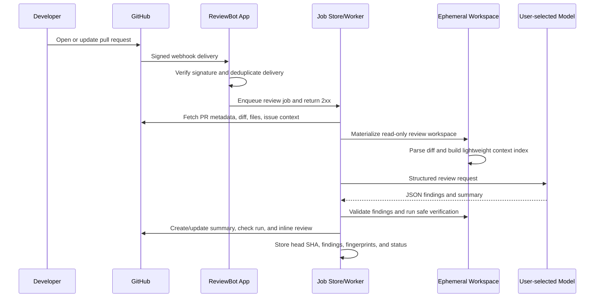
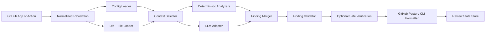

# Open-Source AI Code Review Bot

## Research-backed product and implementation plan

**Research date:** 2026-10-04  
**Repository status:** planning-only; no implementation code exists yet  
**Working name:** ReviewBot (replace before publishing)  
**License recommendation:** Apache-2.0  
**Primary target:** GitHub pull requests  

> This document turns the original `coderabbit_clone_plan.md` into an implementation plan. It intentionally distinguishes publicly documented CodeRabbit behavior from assumptions about its private internals. The goal is to reproduce the useful workflow and quality bar with an independent open-source implementation, not to copy proprietary code, prompts, branding, or undisclosed infrastructure.

## 1. Executive recommendation

Build a self-hosted GitHub App backed by a reusable review engine.

The product should have three layers:

1. **Review engine:** provider-neutral code review pipeline that accepts a normalized pull request and returns validated findings.
2. **GitHub App server:** production integration that receives webhooks, fetches repository context, queues work, and posts native reviews.
3. **Action and CLI adapters:** optional entry points that call the same engine for repositories that prefer GitHub Actions or local reviews.

The first useful release should not attempt to reproduce every CodeRabbit feature. It should reliably do four things:

- understand a pull request beyond the raw diff;
- produce a small number of high-confidence, line-anchored findings;
- post a summary and inline comments back to GitHub;
- avoid leaking secrets or executing untrusted pull-request code.

“Free” needs to be defined precisely:

- the software is free and open source;
- users bring their own model API key, or run a local model such as Ollama;
- hosted model inference is not free unless a provider supplies free quota;
- the project must not promise “unlimited free AI review” when the user still pays the model provider or compute host.

## 2. What the research establishes

### 2.1 Publicly documented CodeRabbit behavior

CodeRabbit publicly describes a context-rich, multi-stage review system rather than a single “send the diff to an LLM” request. Its documentation and engineering posts describe:

- cloning the repository into an isolated sandbox;
- analyzing file relationships, dependencies, project structure, and patterns;
- combining intent, environment, and conversation context;
- using multiple AI models for pull-request reviews;
- using linters and SAST tools as additional signals;
- verifying generated suggestions before posting them;
- writing a summary into the pull-request description;
- posting a structured walkthrough separately from inline comments;
- supporting path-specific instructions and repository guideline files;
- supporting incremental reviews, chat/commands, CLI and IDE workflows;
- offering multi-repository analysis, MCP context, security scans, and agentic fixes in higher-level product surfaces.

Sources:

- [CodeRabbit architecture and pull-request review index](https://docs.coderabbit.ai/llms.txt)
- [Context engineering for AI code reviews](https://www.coderabbit.ai/blog/context-engineering-ai-code-reviews)
- [The art and science of context engineering](https://www.coderabbit.ai/blog/the-art-and-science-of-context-engineering)
- [Explainable reviews and the context engine](https://www.coderabbit.ai/blog/explainable-reviews-coderabbit-review-context-engine)
- [CodeRabbit pricing](https://www.coderabbit.ai/pricing)

### 2.2 What is not known

The public material does not establish the exact internal implementation of:

- the number and role of private agents;
- model routing rules, prompt text, or proprietary ranking algorithms;
- the exact code-graph storage/indexing system;
- internal queue, cache, or sandbox implementation;
- the true precision/recall of its review findings.

Therefore, this plan uses a simpler, testable architecture: deterministic analyzers first, one structured review orchestrator initially, optional specialized passes later, and explicit verification before posting.

### 2.3 Current market facts

The original draft’s pricing section is stale. The current public pricing page lists:

| Public plan | Annual price shown | Monthly price shown | Notable review allowance |
|---|---:|---:|---:|
| Free OSS | Free for public open-source repositories | Free | Subject to the product’s free-tier rules |
| Essentials | $24/developer/month | $30/developer/month | 5 PR reviews per developer/hour |
| Team | $48/developer/month | $60/developer/month | 8 PR reviews per developer/hour |
| Advanced | $72/developer/month | $90/developer/month | 10 PR reviews per developer/hour |
| Enterprise | Custom | Custom | 12 PR reviews per developer/hour shown on the comparison page |

The page also describes usage-based reviews priced per reviewed file and enterprise self-hosting. The open-source opportunity is therefore not “CodeRabbit has no free public tier.” The stronger positioning is:

- self-hosted by default;
- no per-developer seat charge;
- BYOK and local-model support;
- transparent data retention;
- an approachable deployment path;
- an open review engine that users can extend.

### 2.4 Existing alternatives change the scope

PR-Agent’s official documentation shows that a capable open-source competitor already supports GitHub Actions, GitHub App deployment, local execution, multiple providers, and multiple Git platforms.

Sources:

- [PR-Agent GitHub installation and Action/App deployment](https://github.com/The-PR-Agent/pr-agent/blob/main/docs/docs/installation/github.md)
- [PR-Agent automation and provider support](https://github.com/The-PR-Agent/pr-agent/blob/main/docs/docs/usage-guide/automations_and_usage.md)

Do not position the project as “the first free AI PR reviewer.” Position it around a focused differentiator:

> A small, self-hosted, model-agnostic review engine that produces fewer, better-grounded comments and can run with a local model.

## 3. Product definition

### 3.1 Product type

This is a **server application with event-driven integrations**, not primarily a browser extension.

| Surface | Role | Priority |
|---|---|---:|
| GitHub App | Automatic PR reviews, native comments, multi-repository installations | P0 |
| Review engine package | Shared logic and stable API for every surface | P0 |
| GitHub Action | Zero-server deployment for trusted repositories | P1 |
| CLI | Local pre-PR review and CI use | P2 |
| Web dashboard | Configuration/history/metrics UI | P3 |
| GitLab/Bitbucket adapters | Provider expansion | P3 |

### 3.2 Target users

The first target is a developer or small team that:

- owns one or more GitHub repositories;
- wants automatic PR review;
- can provide an LLM API key or local model;
- does not want source code stored by a third-party review SaaS;
- is comfortable running Docker Compose or a small VPS service.

### 3.3 Product promises

The project can promise:

- native GitHub review output;
- repository-local configuration;
- BYOK and OpenAI-compatible endpoints;
- local-model support when the user provides the runtime;
- deterministic line validation and duplicate suppression;
- configurable data retention;
- auditable logs and review state.

The project should not promise initially:

- guaranteed bug detection;
- equivalent quality to CodeRabbit on every language or repository;
- autonomous code changes without explicit approval;
- safe execution of arbitrary pull-request code by default;
- zero cost for hosted model inference.

## 4. Workflow integration

### 4.1 GitHub App workflow — primary



The webhook handler must acknowledge quickly. Review work belongs in a worker so a slow model call cannot make GitHub retry the webhook.

### 4.2 Pull-request event policy

Start with these events:

| Event | Behavior |
|---|---|
| `pull_request.opened` | Review a new non-draft PR if enabled |
| `pull_request.reopened` | Re-review the current head |
| `pull_request.ready_for_review` | Review a PR leaving draft state |
| `pull_request.synchronize` | Review the new commit range incrementally |
| `pull_request.closed` | Cancel queued work and mark the job closed |
| `issue_comment.created` | Handle explicit bot commands on the PR conversation |
| `pull_request_review_comment.created` | Optionally handle mentions on inline threads |
| `installation.deleted` | Remove or disable installation state |

Ignore events authored by the bot itself. Store the GitHub delivery ID and a review key such as `{installation, repository, pullNumber, headSha, mode}` to make retries idempotent.

### 4.3 Incremental review behavior

On a later push, do not blindly review the entire PR again.

1. Load the last completed head SHA for the PR.
2. Ask GitHub for the comparison between the last reviewed commit and the new head.
3. Review changed files and changed hunks first.
4. Re-load related context when a changed symbol’s callers or interfaces are affected.
5. Fingerprint prior findings by file, normalized message, and nearby code hash.
6. Post only new or materially changed findings.
7. Mark prior findings as resolved, stale, or still present.

The initial implementation can use GitHub’s comparison/diff endpoints and stored SHAs. A full code graph is not required for incremental behavior.

### 4.4 Chat workflow

Chat is useful but should not block the first release.

Supported commands after the core review is stable:

- `@reviewbot review` — request or repeat a review;
- `@reviewbot explain` — explain a finding or file range;
- `@reviewbot help` — list supported commands;
- `@reviewbot pause` / `resume` — change automatic review behavior;
- `@reviewbot fix` — produce a suggested patch, but require explicit approval before committing.

Replies must be bounded by the same repository permissions and context policy as automatic reviews. A comment is untrusted input and must never be treated as an instruction to reveal secrets or bypass safety rules.

### 4.5 GitHub Action workflow — secondary

The Action is useful for teams that do not want to host a webhook server:

```yaml
name: ReviewBot

on:
  pull_request:
    types: [opened, reopened, ready_for_review, synchronize]
  issue_comment:
    types: [created]

permissions:
  contents: read
  pull-requests: write
  issues: write
  checks: write

jobs:
  review:
    if: github.event.sender.type != 'Bot'
    runs-on: ubuntu-latest
    steps:
      - uses: reviewbot/reviewbot-action@v1
        with:
          model: openai-compatible
          model_name: ${{ vars.REVIEWBOT_MODEL }}
          api_key: ${{ secrets.REVIEWBOT_LLM_API_KEY }}
```

The Action should prefer GitHub’s API for diff/file retrieval and should not need to execute the pull-request code. It can optionally use a checkout only for explicitly enabled, sandboxed analyzers.

Important GitHub security constraints:

- Fork-triggered `pull_request` workflows normally receive a read-only token and no repository secrets.
- `pull_request_target` receives a privileged token and secrets; it must never check out and execute untrusted pull-request code.
- A self-hosted runner must not be treated as a safe sandbox for arbitrary PR code.
- Pin third-party Actions to immutable commit SHAs in production.

Sources:

- [GitHub workflow permissions](https://docs.github.com/en/actions/reference/workflows-and-actions/workflow-syntax)
- [GitHub workflow events and fork restrictions](https://docs.github.com/en/actions/reference/workflows-and-actions/events-that-trigger-workflows)
- [Secure use of `pull_request_target`](https://docs.github.com/en/actions/reference/security/securely-using-pull_request_target)

For public repositories and untrusted forks, the GitHub App is the safer default because the review service can retrieve source as data and run any analysis in a separately controlled ephemeral workspace.

### 4.6 CLI workflow — later

The CLI should use the same engine with a local source adapter:

```text
reviewbot review                 # current working tree changes
reviewbot review --base main     # branch comparison
reviewbot review --pr 123        # fetch a GitHub PR and print findings
reviewbot review --format json   # machine-readable output for coding agents
reviewbot config validate        # validate .reviewbot.yaml
```

The CLI is valuable for pre-commit and coding-agent loops, but it should not become a second review implementation.

## 5. GitHub App design

### 5.1 Permissions

Request the minimum permissions necessary:

| GitHub App permission | Level | Purpose |
|---|---|---|
| Contents | Read | Read repository files and configuration |
| Pull requests | Write | Read PR metadata and publish reviews/comments |
| Issues | Write | Publish/read conversation comments for chat |
| Checks | Write | Optional review status/check run |
| Metadata | Read | Required baseline permission |

Do not request repository administration, Actions write, secrets, or contents write for the review-only MVP.

GitHub Apps receive webhook events and can use installation access tokens scoped to the installation’s repositories. Installation tokens expire and must be refreshed rather than persisted as long-lived credentials.

Sources:

- [GitHub Apps and webhooks](https://docs.github.com/en/apps/creating-github-apps/registering-a-github-app/using-webhooks-with-github-apps)
- [Choosing GitHub App permissions](https://docs.github.com/en/enterprise-cloud@latest/apps/creating-github-apps/registering-a-github-app/choosing-permissions-for-a-github-app)
- [Creating installation access tokens](https://docs.github.com/en/rest/apps/apps?apiVersion=2026-03-10)
- [GitHub pull-request review API](https://docs.github.com/en/rest/pulls/reviews?apiVersion=2022-11-28)
- [GitHub pull-request review-comment API](https://docs.github.com/en/rest/pulls/comments?apiVersion=2022-11-28)

### 5.2 Authentication flow

1. Register the GitHub App and generate its private key.
2. Store the App ID, private key, and webhook secret outside the repository.
3. Validate `X-Hub-Signature-256` before parsing the payload.
4. Use App credentials to create a short-lived installation token.
5. Restrict API calls to the repository and permissions needed for the job.
6. Rotate the private key and webhook secret using the deployment’s secret manager.

### 5.3 Comment and status behavior

Use native GitHub primitives:

- one replaceable summary comment or PR-description section marked with a stable HTML marker;
- one review submission containing inline comments where possible;
- a check run with `queued`, `in_progress`, `completed`, and conclusion states;
- suggestion blocks only when the proposed replacement is complete and line-valid;
- no more than a configurable maximum number of comments per review.

Every posted comment should include a small machine-readable marker, for example:

```html
<!-- reviewbot:finding:v1:<stable-id> -->
```

This lets the poster update or resolve its own comments without touching human review threads.

## 6. Review engine architecture

### 6.1 System diagram



### 6.2 Pipeline stages

#### Stage A — Intake and normalization

Normalize every surface into one job shape:

```ts
interface ReviewJob {
  provider: "github";
  repository: { owner: string; name: string; id: number };
  pullRequest: { number: number; baseSha: string; headSha: string };
  trigger: "opened" | "reopened" | "ready_for_review" | "synchronize" | "manual";
  installationId?: number;
  deliveryId?: string;
  mode: "full" | "incremental" | "local";
}
```

#### Stage B — Diff and configuration loading

- Fetch the unified diff and changed-file metadata.
- Read the repository configuration at the reviewed commit.
- Read only explicitly supported guideline files such as `AGENTS.md`, `CLAUDE.md`, `CONTRIBUTING.md`, and project review docs.
- Apply path filters before spending model tokens.
- Ignore binaries, generated files, vendored code, lockfiles, and oversized files by default.
- Enforce maximum changed files, maximum bytes, and maximum model budget.

#### Stage C — Context selection

Use a ranked context budget rather than sending the whole repository:

1. Changed hunks and their surrounding lines.
2. The full changed file when it fits the budget.
3. Direct imports, exports, interfaces, schemas, and callers.
4. Tests that exercise changed symbols.
5. PR title/body and linked issue text.
6. Repository guidelines and path instructions.
7. Prior review state and resolved/dismissed finding fingerprints.

The first implementation can discover relationships with language-agnostic import/path heuristics. Add tree-sitter or another AST parser after the end-to-end workflow is reliable.

#### Stage D — Deterministic analysis

Run cheap, non-LLM checks first when available:

- secret and credential patterns;
- dangerous shell or workflow configuration patterns;
- dependency and lockfile consistency;
- repository-provided linters in report-only mode;
- language-specific tools selected by file extension and configuration.

Treat tool output as evidence, not automatically as a review comment. Normalize tool findings into the same internal schema and deduplicate them with model findings.

#### Stage E — Structured LLM review

Use a provider-neutral interface:

```ts
interface LLMProvider {
  complete(request: LLMRequest): Promise<LLMResponse>;
}

interface LLMRequest {
  system: string;
  user: string;
  model: string;
  maxOutputTokens: number;
  responseSchema: "review-output-v1";
}
```

Start with:

- OpenAI-compatible HTTP endpoints;
- Ollama through its OpenAI-compatible endpoint;
- an Anthropic adapter after the core contract is tested.

Keep credentials and provider selection server-side. Repository YAML may select a profile, but it must not be able to replace the system safety policy or exfiltrate secrets.

#### Stage F — Finding validation

Before a finding can be posted:

- validate it against a strict JSON schema;
- ensure the file exists in the PR;
- ensure the line is in a changed hunk or an explicitly allowed nearby range;
- ensure the side is valid for the GitHub review API;
- reject malformed or multi-file suggestions;
- check that the finding is not a duplicate;
- require an evidence statement tied to the code or tool output;
- apply severity and comment-count thresholds.

Never post an LLM finding solely because the model returned it.

#### Stage G — Safe verification

MVP verification is read-only:

- search the referenced symbol or pattern;
- inspect the final code at the target line;
- check that the suggested replacement parses when a parser is available;
- compare the finding against configured guidelines;
- optionally rerun a repository-provided linter without secrets.

Later, add an ephemeral verification container with:

- no network access by default;
- no GitHub or LLM credentials;
- read-only source mount;
- CPU, memory, process, and wall-clock limits;
- non-root user;
- destroyed workspace after the job.

Do not execute arbitrary project build scripts as part of the MVP review service.

### 6.3 Internal finding schema

```ts
interface ReviewOutput {
  schemaVersion: "review-output-v1";
  summary: string;
  walkthrough: Array<{
    file: string;
    summary: string;
    ranges?: string[];
  }>;
  findings: ReviewFinding[];
}

interface ReviewFinding {
  id: string;
  file: string;
  line: number;
  endLine?: number;
  side: "RIGHT" | "LEFT";
  severity: "critical" | "warning" | "suggestion" | "nitpick";
  category: "bug" | "security" | "performance" | "correctness" | "style";
  title: string;
  message: string;
  evidence: string;
  suggestion?: string;
  confidence: number;
}
```

Use a small number of severities and keep `nitpick` disabled by default. The product’s trust depends more on precision than on the raw number of comments.

## 7. Repository configuration

Use a project-owned `.reviewbot.yaml`. Do not copy CodeRabbit’s configuration name or schema.

```yaml
version: 1

review:
  enabled: true
  profile: assertive       # quiet | balanced | assertive
  min_severity: warning
  max_findings: 20
  draft_pull_requests: false
  path_filters:
    - "!dist/**"
    - "!build/**"
    - "!**/*.lock"
    - "!**/*.min.js"
    - "!**/generated/**"
  instructions: |
    Only report issues introduced by this pull request.
    Prefer correctness and security findings over style preferences.

path_instructions:
  - path: "src/api/**"
    instructions:
      - Check authentication, authorization, input validation, and error handling.
  - path: "tests/**"
    instructions:
      - Check edge cases and whether changed behavior is covered.
  - path: "docs/**"
    instructions:
      - Check links and consistency, but keep review light.

tools:
  enabled: true
  run_existing_configs: true

chat:
  enabled: false
```

Configuration rules:

- server environment variables hold API keys, App credentials, and provider endpoints;
- repository configuration controls review behavior only;
- invalid configuration fails closed with a clear check-run message;
- configuration is versioned with the code and included in review context;
- path instructions are data, not privileged system instructions.

## 8. Recommended technical architecture

### 8.1 Initial stack

| Layer | Recommendation | Reason |
|---|---|---|
| Language | TypeScript on Node.js | Strong GitHub ecosystem and shared code across App, Action, and CLI |
| HTTP server | Fastify | Small, fast webhook server with explicit middleware |
| GitHub API | Octokit | Official ecosystem and typed API surface |
| Validation | Zod or equivalent JSON-schema validator | Validate config, jobs, and model output |
| YAML | A maintained YAML parser | Read repository configuration safely |
| Logging | Structured JSON logger | Debug webhook/job failures without logging source or secrets |
| State | SQLite for one instance; PostgreSQL later | Low-friction self-hosting first, reliable multi-worker option later |
| Queue | In-process bounded worker first; Redis/BullMQ only when needed | Avoid forcing Redis on the first deployment |
| Packaging | Docker image plus Docker Compose | Reproducible self-hosting |
| Tests | Unit, mocked integration, and golden review fixtures | Review quality needs regression tests, not only endpoint tests |

### 8.2 Project structure

```text
reviewbot/
├── apps/
│   ├── server/                 # GitHub App webhook server and worker
│   ├── action/                 # Thin GitHub Action adapter
│   └── cli/                    # Thin local adapter
├── packages/
│   ├── review-core/            # Pipeline orchestration and contracts
│   ├── config/                 # YAML schema and loader
│   ├── diff/                   # Diff parsing and line mapping
│   ├── context/                # Context ranking and token budgeting
│   ├── analyzers/              # Deterministic checks and tool adapters
│   ├── llm/                    # Provider interface and adapters
│   ├── github/                 # Auth, API, webhook types, posting
│   ├── persistence/            # Review state and migrations
│   └── sandbox/                # Explicitly opt-in isolated execution
├── fixtures/                   # Small repositories and known-bug diffs
├── .github/workflows/          # CI and dogfood workflow
├── Dockerfile
├── compose.yaml
├── package.json
├── tsconfig.json
└── README.md
```

### 8.3 Storage model

Minimum entities:

```text
installations
  id, github_installation_id, account_login, created_at, disabled_at

repositories
  id, installation_id, owner, name, default_branch, enabled, config_hash

review_jobs
  id, repository_id, pr_number, trigger, base_sha, head_sha,
  delivery_id, status, attempt_count, started_at, completed_at, error

reviews
  id, job_id, mode, model, input_hash, output_hash, summary, status

findings
  id, review_id, stable_key, file, line, severity, category, message,
  confidence, github_comment_id, state, created_at
```

Do not store full source files or secrets by default. Store hashes, metadata, rendered output, and only the minimum snippets needed for debugging. Make retention configurable and document it.

## 9. MVP scope and non-goals

### 9.1 MVP release

The first release is complete when it can:

- receive and validate a GitHub App webhook;
- authenticate with an installation token;
- fetch a PR diff and changed file contents;
- load and validate `.reviewbot.yaml`;
- apply path filters and token/file budgets;
- call one OpenAI-compatible provider;
- parse strict structured output;
- reject invalid line anchors and duplicate findings;
- post a replaceable summary, inline comments, and a check run;
- retry transient failures and avoid duplicate reviews;
- persist job/review state in SQLite;
- run in Docker Compose;
- provide a documented local test fixture;
- pass security tests for signature validation, prompt injection, and forked PR handling.

### 9.2 Deliberately deferred

Do not put these in the first end-to-end milestone:

- multi-agent orchestration;
- full repository code graph;
- sequence diagrams;
- autonomous commits or auto-fix branches;
- persistent “learning” from conversations;
- multi-repository context;
- web dashboard;
- GitLab, Bitbucket, or Azure DevOps;
- broad linter catalog;
- arbitrary command execution;
- approval or merge automation.

These features are valuable only after the basic reviewer is trusted and observable.

## 10. Phased roadmap

### Phase 0 — Contracts and security boundary

- Decide the final project name and license.
- Define `ReviewJob`, `ReviewOutput`, and `ReviewFinding` schemas.
- Define supported input sizes and retention defaults.
- Build webhook signature verification tests.
- Write the threat model before adding sandbox execution.

### Phase 1 — Core review engine

- Implement diff parsing and changed-line mapping.
- Implement YAML config schema and path filters.
- Implement provider-neutral LLM interface.
- Implement one OpenAI-compatible adapter and a fake test adapter.
- Implement structured output validation and finding normalization.
- Add golden fixtures with seeded bugs and expected findings.

### Phase 2 — GitHub App MVP

- Register a development GitHub App.
- Implement webhook routes and event filters.
- Implement installation-token auth and least-privilege API client.
- Add bounded job processing and retries.
- Fetch PR data through GitHub APIs.
- Post summary, review, inline comments, and check-run status.
- Add SQLite persistence and idempotency.
- Run the bot on this repository’s future pull requests.

### Phase 3 — Operational hardening

- Docker Compose deployment and `.env.example`.
- Health/readiness endpoints.
- Structured logs with redaction.
- Metrics for latency, token usage, failures, and findings.
- Maximum concurrency and per-repository rate limits.
- Review cancellation on closed PRs.
- Retention cleanup and backup guidance.
- Security review of the deployment and webhook endpoint.

### Phase 4 — Action and CLI adapters

- Publish the thin GitHub Action.
- Add a safe workflow template with minimal permissions.
- Add local CLI output and JSON mode.
- Add `reviewbot config validate`.
- Reuse the exact core engine and fixtures.

### Phase 5 — Quality improvements

- AST-aware context extraction for two or three priority languages.
- More deterministic tools: secret scanning, workflow linting, dependency checks.
- Optional ephemeral verification sandbox.
- Incremental review reconciliation and stale-comment handling.
- Ollama/local-model documentation and tested adapters.
- Basic chat commands with strict context and rate limits.

### Phase 6 — Advanced product surfaces

- Review memory with explicit user-controlled learnings.
- Sequence diagrams only for changes that benefit from them.
- Multi-repository context.
- Human-approved autofix branches.
- Dashboard and organization-level configuration.
- Additional Git providers.

## 11. Quality, evaluation, and success metrics

### 11.1 Test layers

1. **Unit tests:** diff parsing, line mapping, filters, config merging, schema validation, comment fingerprinting.
2. **Mocked GitHub tests:** webhook payloads, permissions errors, rate limits, retries, pagination, stale heads.
3. **Mocked LLM tests:** malformed JSON, extra prose, hallucinated files, invalid lines, prompt injection.
4. **Golden fixtures:** known vulnerabilities, logic bugs, regressions, and no-issue PRs.
5. **End-to-end tests:** a temporary GitHub repository or replayed webhook/API fixture.
6. **Security tests:** fork PR, draft PR, bot-loop, secret redaction, malicious config, oversized diff, and untrusted tool output.

### 11.2 Initial success criteria

Measure the system instead of claiming a percentage of CodeRabbit’s value:

- webhook-to-result success rate;
- median and p95 review latency;
- percentage of findings with valid line anchors;
- duplicate-comment rate;
- user-dismissed finding rate;
- accepted/fixed finding rate;
- token cost per reviewed changed line;
- percentage of reviews that exceed configured budgets;
- false-positive rate on the golden fixture set;
- data retained after the configured retention window.

The most important early metric is **actionable finding precision**, not the total number of findings.

## 12. Threat model and operational risks

| Risk | Why it matters | Mitigation |
|---|---|---|
| Webhook spoofing | Attackers could trigger jobs or post comments | HMAC signature validation, replay/idempotency checks |
| Prompt injection in source/comments | Repository text can attempt to override reviewer rules | Treat all repo/PR text as untrusted data; fixed system policy; output validation |
| Secret exposure to model | Source, logs, or environment may contain credentials | Redaction, no secrets in prompts, user-owned key, configurable provider endpoint |
| Arbitrary PR code execution | A malicious PR can compromise a runner or host | Read-only API mode by default; no build/test execution; rootless ephemeral sandbox later |
| Fork workflow privilege | Forks normally lack secrets/write permissions; unsafe workarounds can leak them | Prefer App; never use unsafe `pull_request_target` checkout; document limitations |
| LLM hallucination | Incorrect comments damage trust | Conservative profile, evidence field, line validation, deterministic verification |
| Duplicate comments | Retries and new pushes create noise | Delivery/job idempotency and stable finding fingerprints |
| Large PRs | Cost, latency, context overflow | File filters, chunking, prioritization, hard budgets, summary-only fallback |
| GitHub rate limits | Reviews can fail under load | Pagination, backoff, bounded concurrency, installation-scoped client |
| Model/provider outage | Review workflow becomes unreliable | Retry, clear check status, optional fallback provider, never block merges silently |
| Data retention | Self-hosted users still need predictable deletion | Document storage, default short retention, cleanup job, no source cache by default |
| Supply-chain risk | Actions and analyzers can be compromised | Pin dependencies/actions, lockfiles, SBOM, minimal runtime image |

## 13. First implementation backlog

The first coding pass should be ordered like this:

1. Replace the working name and choose the license.
2. Create the TypeScript workspace and package boundaries.
3. Add schemas for jobs, configuration, LLM output, and findings.
4. Implement a fake GitHub source and fake LLM provider.
5. Build diff parsing and changed-line validation from fixtures.
6. Build the provider-neutral review engine.
7. Add the real OpenAI-compatible adapter with token/time budgets.
8. Register a development GitHub App and implement signature validation.
9. Implement PR event intake, job state, and installation-token API calls.
10. Post a check run and summary before enabling inline comments.
11. Add inline comments with stable markers and duplicate suppression.
12. Add Docker Compose, health checks, redacted logs, and setup documentation.
13. Dogfood on this repository and tune the review profile using measured false positives.

## 14. Final architectural decisions

| Decision | Recommendation | Rationale |
|---|---|---|
| Primary integration | GitHub App | Best security and UX for automatic multi-repository reviews |
| Shared implementation | Core package plus adapters | Prevents Action/CLI/server drift |
| First model support | OpenAI-compatible endpoint | Covers hosted APIs, gateways, and Ollama with one contract |
| Data model | SQLite first, PostgreSQL later | Keeps self-hosted setup simple without blocking scale |
| Queue | Bounded worker first, external queue later | Avoids Redis as a mandatory dependency before traffic exists |
| Review strategy | One orchestrator plus deterministic analyzers first | Easier to test and cheaper than premature multi-agent routing |
| Code graph | Lightweight import/context heuristics first; AST later | Proves the workflow before building language infrastructure |
| Auto-fix | Suggestions only after validation; commits later | Avoids unauthorized code changes and trust failures |
| Execution | No arbitrary PR code in MVP | Security boundary is more important than feature parity |
| Configuration | New `.reviewbot.yaml` schema | Independent product identity and simpler initial contract |
| Licensing | Apache-2.0 | Permissive use with explicit patent protection |

## 15. Research sources

Primary sources used for this plan:

- [CodeRabbit documentation index](https://docs.coderabbit.ai/llms.txt)
- [CodeRabbit pricing](https://www.coderabbit.ai/pricing)
- [CodeRabbit context engineering](https://www.coderabbit.ai/blog/context-engineering-ai-code-reviews)
- [CodeRabbit architecture/context-engine blog](https://www.coderabbit.ai/blog/explainable-reviews-coderabbit-review-context-engine)
- [CodeRabbit self-hosted documentation index entry](https://docs.coderabbit.ai/self-hosted/overview.md)
- [GitHub Apps webhooks](https://docs.github.com/en/apps/creating-github-apps/registering-a-github-app/using-webhooks-with-github-apps)
- [GitHub App permissions](https://docs.github.com/en/enterprise-cloud@latest/apps/creating-github-apps/registering-a-github-app/choosing-permissions-for-a-github-app)
- [GitHub installation access tokens](https://docs.github.com/en/rest/apps/apps?apiVersion=2026-03-10)
- [GitHub workflow permissions](https://docs.github.com/en/actions/reference/workflows-and-actions/workflow-syntax)
- [GitHub fork workflow restrictions](https://docs.github.com/en/actions/reference/workflows-and-actions/events-that-trigger-workflows)
- [GitHub `pull_request_target` security](https://docs.github.com/en/actions/reference/security/securely-using-pull_request_target)
- [GitHub pull-request reviews API](https://docs.github.com/en/rest/pulls/reviews?apiVersion=2022-11-28)
- [GitHub pull-request review comments API](https://docs.github.com/en/rest/pulls/comments?apiVersion=2022-11-28)
- [PR-Agent GitHub installation](https://github.com/The-PR-Agent/pr-agent/blob/main/docs/docs/installation/github.md)
- [PR-Agent supported providers and automations](https://github.com/The-PR-Agent/pr-agent/blob/main/docs/docs/usage-guide/automations_and_usage.md)
